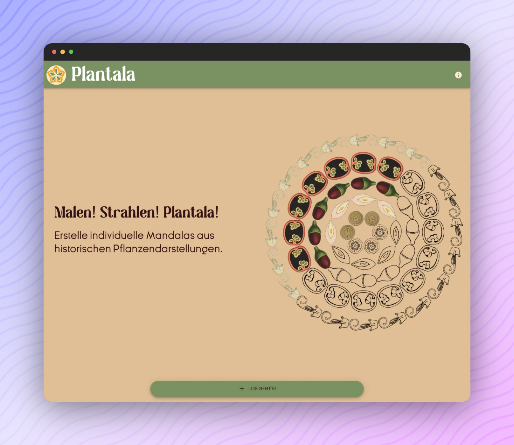

<p align="center">
  <a href="https://digitalwarenkombinat.github.io/plantala/">
    
  </a>
</p>

---

[](https://digitalwarenkombinat.github.io/plantala/)

## About [_Plantala_](https://digitalwarenkombinat.github.io/plantala/)

The **Plantala** web application was created as a prototype as part of the Coding da Vinci Niedersachsen 2020 cultural hackathon and was renewed and further developed during a three-month grant. 

With **Plantala** you can create your own mandalas from aesthetic plant parts, save them, print them out and color them. You can also learn something about the special characteristics of individual plants.

**Plantala** allows to print the mandalas in combination with the information as a worksheet.

The images are based on plant elements from botanical teaching posters, which the Custody of the University of Göttingen has digitized and made available.

All black and white vector graphics and plantalas created are freely licensed and can be used in a variety of ways, e.g. for lessons, for environmental education offers or simply for private decoration.

_**Plantala's** source code runs under an MIT license. Some of the digital copies of botanical teaching posters provided by the University of Göttingen were published under a CC BY-SA 4.0 license. The teaching charts that previously appeared in published works run under a Public Domain Mark 1.0 and are therefore in the public domain. This also applies to the colorful plant cuttings. All black and white plant vectors created specifically for the project run under a CC BY-SA 4.0 license._


### MaaS (Media station as a Service)

Furthermore within the project developed the idea of **Media station as a Service (MaaS)**, which allows easily to reuse the framework of the **Plantala** project to create new, simple Mandala generators and to use them as media station for example in museums, galleries or educational centers.

## [Create your own media station!](./medienstationAsAService/README.md)

## Feedback

Feel free to send us feedback on [Twitter](https://twitter.com/digiwako) or [file an issue](https://github.com/digitalwarenkombinat/plantala/issues/new). Feature requests are always welcome.

## Getting started

Run the following command on your local environment:

```
git clone --depth=1 https://github.com/digitalwarenkombinat/plantala.git
cd plantala
npm install
```

You can run the application in development mode with live reload:

```
npm run dev
```

Open http://localhost:3000 with your favorite browser to see the application.

```
.
├── README.md            # README file
├── next.config.js       # Next JS configuration
├── public               # Public folder
│   └── images           # Images used by the application
├── components
│   ├── ui               # Visual components
│   └── utils            # Utility folder
├── pages                # Next JS pages
└── tsconfig.json        # TypeScript configuration
```

You can see the results locally in production mode with:

```
npm run build
npm run start
```

The generated HTML and CSS files are minified (built-in feature from Next js).
